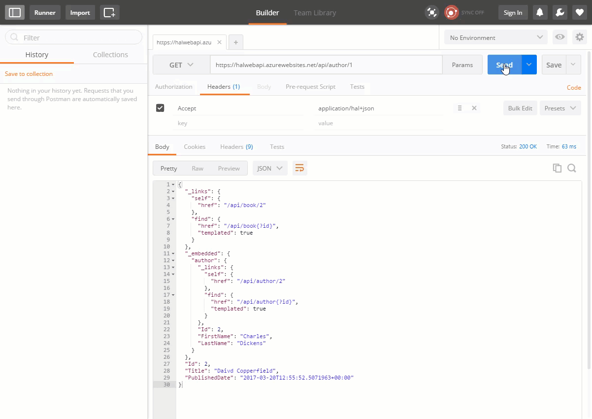

# WebApi.Hal
A Web API Server configuration based hal+json media type formatter

## Sample API running at http://halwebapi.azurewebsites.net



## Create Hal type configurations 

1. Create a class that implements HalTypeConfiguration<T>

2. Override the AddLinks<T>(T value) method so you can add the appropriate links for your type.

Example: 

```
public class AuthorHalConfiguration : HalTypeConfiguration<Author>
{
    public AuthorHalConfiguration() : base("/api/author")
    {
    }

    protected override void AddLinks(Author value)
    {
        if (value == null)
            return;

        AddLink("self", value.Id.ToString()); //add self link
        AddLinkTemplate("find", "{?id}"); //add find link
    }
}

```

## Create A HalConfig file

1. In the App_Start directory of your web api project create a HalConfig.cs file
2. Add the following code to this file

```
 public static class HalConfig
    {
        public static void Register(HttpConfiguration config)
        {
            config.AddHalMediaFormatter(
                configs => { 
                    configs.AddConfiguration(typeof(Author), //Example adding a type config
                        new AuthorHalConfiguration());
                        });
        }
    }
```


3. In the HalConfig add HalTypeConfigurations by first specifying the type that will use it and then the associated configuration. 


```
configs.AddConfiguration(typeof(Author), //Example adding a type config
                        new AuthorHalConfiguration());
```

4. If you add more than one config and your type has a member of a type that is conifgured embedded resources will just work
 

## Registering the Hal Media Type Formatter

1. Open your Global.asax.cs file
2. Add the following line
 ```
  GlobalConfiguration.Configure(HalConfig.Register);
 ```
 
## Sample Request Response

### Request
```
GET api/author/2

Accept: application/hal+json
```
### Response
```
{
  "_links": {
    "self": {
      "href": "/api/author/2"
    },
    "find": {
      "href": "/api/author{?id}",
      "templated": true
    }
  },
  "Id": 2,
  "FirstName": "Charles",
  "LastName": "Dickens"
}
```

## Sample with Embedded Resources

### Request
```
GET api/book/2

Accept: application/hal+json
```

### Response

```
{
  "_links": {
    "self": {
      "href": "/api/book/2"
    },
    "find": {
      "href": "/api/book{?id}",
      "templated": true
    }
  },
  "_embedded": {
    "author": {
      "_links": {
        "self": {
          "href": "/api/author/2"
        },
        "find": {
          "href": "/api/author{?id}",
          "templated": true
        }
      },
      "Id": 2,
      "FirstName": "Charles",
      "LastName": "Dickens"
    }
  },
  "Id": 2,
  "Title": "Daivd Copperfield",
  "PublishedDate": "2017-03-20T06:46:02.539107-05:00"
}
```


